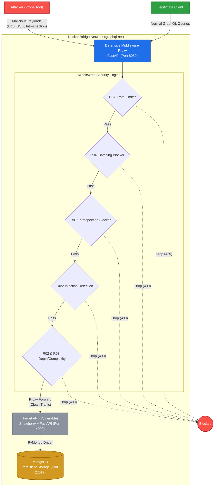

# Architecture Diagram

**Problem Statement:** #18 - GraphQL API Security Auditor (Introspection & Injection)
**Target Architecture:** Cloud-Native / Microservices (Application Layer)

Team 05:
Ananya Santosh- BL.EN.U4CSE23207
Anvita Arasavilli- BL.EN.U4CSE23208
Janhavi Nilesh Parate- BL.EN.U4CSE23224
Keerthi DA- BL.EN.U4CSE23233
Lakshmi Priya Subramanian- BL.EN.U4CSE23236

---

The diagram below illustrates the flow of traffic in the target cloud-native architecture. Our defensive solution (the Middleware Proxy) intercepts all traffic between external clients and the vulnerable internal microservices.

## How It Integrates
1. **Network Layer**: The entire system is deployed via Docker Compose. The `target-api` and `mongodb` do not expose their ports to the open internet in a production setting; they are only reachable via the Docker bridge network.
2. **Reverse Proxy**: The `middleware` exposes port 8080 to the public. It acts as the single ingress point.
3. **Stateless Enforcement**: The middleware holds no database connection itself. It relies entirely on in-memory heuristics and request parsing to rapidly validate payloads before forwarding them downstream.
4. **Resilience**: If the middleware were to go down, external traffic simply cannot reach the target API, meaning it fails securely (fail-closed) from an external perspective, protecting the vulnerable backend.
